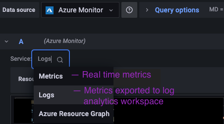

# Observability for Large Scale Managed Applications Deployments in Azure

Modern distributed systems are complex in nature. They are comprised of multiple computing elements, services, and applications. These systems are often deployed in multiple geographic regions and handle a wide range of demand as well as sporadic bursts. With monolithic systems, scaling up was the only option to handle growing user demand. Distributed systems allow options to both scaling up and scaling out.

Scaling up means adding resources - CPU/Memory/Network IO to accommodate the demand. Even though hardware is relatively cheap, there is a ceiling as to how powerful the system can grow. What do you do when it's not enough? Even if scaling up handles the load OK, there are still two issues we are facing. First, what happens when we only need to scale up occasionally? It would mean a lot of wasted resources because we can't scale down easily. Second, what happens when there is a failure and it takes an extended period of time to recover from the failure due to the size of the system? Scaling out helps to resolve both these issues. However, it introduces great complexity in system observability. While server logs used to be the go to place to understand system behaviors for monolithic systems, the distributed and chaotic nature of modern systems makes it next to impossible to resort to logs.

Modern day CI/CD also means applications and services could be updated at any time. But how do you manage the dependencies when you have a web of intertwined services and applications? How do you address orchestrated horizontal scaling out for multiple components? How do you meet RTO (Recovery Time Objective) and RPO (Recovery Point Objective) requirements when the system fails and needs to be recovered with short recovery time and minimal data loss? These are some of the challenges system operators and developers face every day.

[Azure Managed Applications](https://learn.microsoft.com/en-us/azure/azure-resource-manager/managed-applications/overview) was created to enable service providers to offer cloud solutions that are easy for consumers to deploy and operate. It's similar to a solution template in the Marketplace where infrastructure, applications and services are packaged and deployed as one solution. We use this packaged template to help manage the deployment and scaling needs of enterprise systems that require high scalability and high reliability.

 We define a managed application in terms of a "scale unit" that groups together related components that have similar scaling requirements. A scale unit, once defined, will have clear [Service Level Objectives](https://learn.microsoft.com/en-us/azure/cloud-adoption-framework/manage/monitor/service-level-objectives)(SLOs). Scaling out means deploying additional scale units to maintain these SLOs as demand increases. Each scale unit will live in a single geographic region. In theory and practice, this is similar to sharding of a database - even though scaling up might meet the demand, it would potentially mean a prolonged time to remediate or recover should the single system come down for any reason. Separating traffic to individual scale units allows the system to adjust to user demand while at the same time maintaining required SLO, RTO and RPO.  

The ability to deploy these scale units addresses the scaling and performance non-functional requirements of the system - each scale unit has a predefined capacity boundary measured by SLOs. When it reaches the boundary, a new scale unit will be deployed and started to help out. However, this brings up a new challenge - large scale system can have dozens or even hundreds of scale units, each operating within their predefined capacity boundary. How do we ensure the system is reliable? How do we get insight into system performance to identify trouble spots easily, pinpoint pain points quickly, and address them promptly? In short, how do we know we are meeting the SLOs and if not, how do we mitigate as quickly as possible?

[Azure Managed Grafana](https://learn.microsoft.com/en-us/azure/managed-grafana/overview) is a data visualization platform built on top of the Grafana software by Grafana Labs operated and supported by Microsoft. It has built-in support for [Azure Monitor](https://learn.microsoft.com/en-us/azure/azure-monitor/overview) and [Azure Data Explorer](https://learn.microsoft.com/en-us/azure/data-explorer/data-explorer-overview). User authentication and access control is provided by [Azure Active Directory](https://learn.microsoft.com/en-us/azure/active-directory/fundamentals/active-directory-whatis).

We created two dashboard solutions. In both cases, we focus on achieving effective observability by creating dashboards with Azure Managed Grafana using the Azure Monitor data source. These dashboards provides clarity to the correlation between components within the scale units. When configured properly, it will give real time feedback to the scale unit configuration and resource allocation, help identify bottleneck and trouble spots. These information will be helpful guidance on resource provision and scaling directions as well as help making system design and implementation decisions.

The first approach uses auto instrumentation from Azure. Metrics data are exported to log analytics workspace. The second approach uses both auto instrumentation and custom instrumentation with [Open Telemetry](https://opentelemetry.io/). Metrics data are exported to application insights using Java Agents. Custom instrumentation through Open Telemetry allows new perspective where the dashboard is built centered around scenarios/user actions. Both approach is detailed below respectively. 

## Approach 1 - Azure Auto Instrumentation
### Prerequisite

#### Define SLOs for the Scale Unit

Look at the scale unit as a whole to figure out what function it serves and what's the throughput/response time/error rate ... etc. we are looking to achieve before focusing on individual components. Once the overall SLOs for the scale unit is set, we use that as the baseline to define individual component metrics that will be figured in system health calculation.

While this is key in determining system health, we can start with our best guesses and go in iterations to better the definition and metrics selection. The concept here is that the monitoring will provide feedback to incident mitigation and system design. It's an ever evolving process.

#### [Log Analytics Workspace](https://learn.microsoft.com/en-us/azure/azure-monitor/logs/log-analytics-workspace-overview)

We will export all metrics from scale unit components to a workspace. The log analytics workspace identity need to be assigned the Azure Monitor Reader role.

Individual components need to configure Diagnostic Settings to enable exporting metrics data to the appropriate log analytics workspace.

#### [Azure Managed Grafana](https://learn.microsoft.com/en-us/azure/managed-grafana/overview)

This is the visualization end point. There is no need for a Grafana enterprise license. The end point needs to be assigned the Log Analytics Reader role.

### System Health Calculation

A Scale Unit is a set of infrastructure and applications that are related and meant to be scaled out as a suite. These infrastructure and applications are deployed using the Azure Managed application defined within the Service Catalog.

In our example, we have defined a scale unit to consist of an Event Hub that takes incoming requests, an Azure Function that gets triggered by the Event Hub requests, and a storage account that that stores the Azure Function output.

Scale Unit health is calculated by looking at each component and setting up threshhold numbers for key metrics based on component SLOs. The dashboard will query the Azure Resource Graph for component information, which is then used to query the Log analytics workspace for component performance metrics. These numbers will be compared with component SLOs and threshholds to reach the "Healthy, Degraded, Unhealthy" conclusion. The Azure Monitor data source in Azure Managed Grafana provides an integrated experience.

### [Azure Monitor Data Source for Azure Managed Grafana](https://grafana.com/docs/grafana/latest/datasources/azure-monitor/)

Preloaded to Azure Managed Grafana as long as the correct role is set up for the Azure Managed Grafana endpoint.


#### Metrics

    Real time metrics from Azure Resources and Applications report to Azure Monitor. 

#### Logs

    Metrics exported from various Azure services and applications. There is a 30 seconds to a few minutes delay. While this table may contain other data, in our example we are only using metrics.

#### Resource Graph

    Enables you to get full visibility into your environments by providing high performance and powerful querying capability across all your resources.

### Dashboard Design

The solution consists of two boards (TopLevelView & ScaleUnitView) dynamically generated based on application deployment.

#### Top Level View

The goal is to give the user a quick and direct view of the system health as a whole. There are selectors and filters set up to help customize the view, allowing users to select the environment, region or health condition that they are interested in analyzing. A combination of "gauge", "stat", and "table" panels are used to generate the top two rows that display the system health summary view. 

 The Scale unit health break down list uses "gauge" panels to give an overview of the scale unit health and individual component health. Clicking on either panel will open the Scale Unit Level View.

#### 
#### 

#### Scale Unit Level View

    Drills down to an individual scale unit. It presents an in-depth view of metrics from Azure Monitor for each component to help with troubleshooting and issue mitigation. You can pick and choose which metrics are most important to the component.

#### 

### Dashboard implementation

### Identify SLOs for Each Component of the Scale Unit

To calculate scale unit health, we need to first identify the SLOs for the scale unit. This is key to the success. That being said, it could be an iterative process where we start with.

#### Azure Resource Graph Query

    Azure Managed Applications uses a service catalog to provision infrastructure and deploy applications as a unit. This allows us to run an Azure Resource Graph query to get back all resource groups for the managed application. This allows us to generate the scale units in the break down list dynamically based on the deployment and user's selection.

    We defined variables in the TopLevelView board to cache the results of these Resource Graph Queries so that we could use them later in our log analytics KQL queries.

##### Query to retrieve Manged Application

    ```
    Resources 
    | where name == "Managed-ScaleUnit"
    | where type == "microsoft.solutions/applicationdefinitions"
    | project name

    ```

##### Query to retrieve resource group mapping

    This will create a '/' delimited string with scaleunit name and resource group mapping separated by ;
    ```
    Resources 
    | where type == "microsoft.solutions/applications"
    | where split(parse_json(properties).applicationDefinitionId,"/")[array_length(split(parse_json(properties).applicationDefinitionId,"/")) - 1] == ("$managedApp")
    | where location in ($Location)
    | project info = strcat(name, ";", tolower(split(parse_json(properties).managedResourceGroupId, '/')[4]))
    ```

##### Query to retrieve resource groups only

    ```
    Resources 
    | where type == "microsoft.solutions/applications"
    | where location in ($Location)
    | where split(parse_json(properties).applicationDefinitionId,"/")[array_length(split(parse_json(properties).applicationDefinitionId,"/")) - 1] == ("$managedApp")
    | project resourceGroup = tostring(tolower(split(parse_json(properties).managedResourceGroupId, '/')[4]))

    ```

#### Log Analytics KQL to calculate System health based on user's selection

    There are two KQL queries for the log analytics workspace. These queries make use of variables defined at the top level view board. 

KQL for SLO across all scale units for individual components. This serves as data source on the top panel

    ``` KQL
    let timeTo = $__timeTo();
    let eh_incoming =
    AzureMetrics
    | where ResourceProvider == "MICROSOFT.EVENTHUB"
    | where MetricName == "IncomingRequests" and tolower(ResourceGroup) in ($resourceGroups)
    | where TimeGenerated > timeTo - 30m and TimeGenerated <= timeTo
    | summarize IncomingByUnit = avg(Total) by _ResourceId
    | summarize  Incoming = percentiles(IncomingByUnit,  95)
    | project  Incoming, id=1;
    let af_duration = 
    AppMetrics
    | where Name == "BlobAggregator AvgDurationMs"
    | where TimeGenerated > timeTo - 30m  and TimeGenerated <= timeTo
    | where split(_ResourceId,"/")[4] in ($resourceGroups)
    | summarize  DurationByUnit = avg(Max) by _ResourceId
    | summarize Duration =  percentiles(DurationByUnit,  95)
    | project  Duration, id = 1;
    let storage_ingress =
    AzureMetrics
    | where ResourceProvider == "MICROSOFT.STORAGE" and MetricName == "Ingress" and tolower(ResourceGroup) in ($resourceGroups)
    | where TimeGenerated > timeTo - 30m  and TimeGenerated <= timeTo
    | summarize IngressByUnit = avg(Average) by _ResourceId
    | summarize StorageIngress = percentiles(IngressByUnit, 95)
    | project StorageIngress, id = 1;
    eh_incoming
    | join kind = inner af_duration on id
    | join kind = inner storage_ingress on id
    | project Incoming, Duration, StorageIngress

    ```

    #### KQL for calculating Scale Unit Health for each resource group. The results of this query are cached in a variable at the TopLevelView board, allowing us to feed multiple panels on the screen more efficiently.

    ```
    let rgArray = split("$resourceGroups",",");
    let rgTable = range ind from 0 to array_length(rgArray)-1 step 1
    | project ResourceGroup = substring(rgArray[ind],1, strlen(rgArray[ind])-2);
    let healthy = 1;
    let degraded = 2;
    let unhealthy = 3;
    let ingress_zero_bound = 500;
    let ingress_lower_bound = 500000;
    let ingress_upper_bound = 5000000;
    //let timeFrom = $__timeFrom();
    let timeTo = $__timeTo();
    //let timeInterval = timeTo - timeFrom;
    let storage_ingress =
    AzureMetrics
    | where tolower(ResourceGroup) in ($resourceGroups) and MetricName == "Ingress"
    | where TimeGenerated > timeTo - 30m and TimeGenerated <= timeTo
    | summarize ingress_avg = avg(Average) by ResourceGroup
    | extend storage_signal = iff (ingress_avg< ingress_zero_bound, unhealthy, iff(ingress_avg>ingress_lower_bound, iff(ingress_avg>ingress_upper_bound, unhealthy, degraded), healthy))
    | project ResourceGroup = tolower(ResourceGroup), storage_signal, ingress_avg;
    let incoming_zero_bound = 2;
    let incoming_lower_bound = 5000;
    let incoming_upper_bound = 10000;
    let ehn_incoming =
    AzureMetrics
    | where tolower(ResourceGroup) in ($resourceGroups) and MetricName == "IncomingRequests"
    | where TimeGenerated > timeTo - 30m and TimeGenerated <= timeTo
    | summarize incoming_avg = avg(Total)  by ResourceGroup
    | extend ehn_signal = iff (incoming_avg < incoming_zero_bound, unhealthy, iff(incoming_avg>incoming_lower_bound, iff(incoming_avg>incoming_upper_bound, unhealthy, degraded), healthy))
    | project ResourceGroup = tolower(ResourceGroup), ehn_signal, incoming_avg;
    let duration_lower_bound = 150;
    let duration_upper_bound = 300;
    let fa_duration =
    AppMetrics
    | where Name has "AvgDurationMs" and split[_ResourceId,"/"](4) in  ($resourceGroups)
    | where TimeGenerated > timeTo - 30m and TimeGenerated <= timeTo
    | project TimeGenerated, Name, Sum, ResourceGroup = tolower(split[_ResourceId,"/"](4))
    | summarize func_avg = avg(Sum) by ResourceGroup
    | extend fa_signal = iff(isnan(func_avg), unhealthy, iff(func_avg>duration_lower_bound, iff(func_avg>duration_upper_bound, unhealthy, degraded), healthy))
    | project ResourceGroup, fa_signal, func_avg;
    rgTable
    | join kind=leftouter  storage_ingress on ResourceGroup
    | join kind = leftouter ehn_incoming on ResourceGroup
    | join kind = leftouter fa_duration on ResourceGroup
    | extend Unit= array_reverse(split(substring("$groupMapping", 0, indexof("$groupMapping", ResourceGroup) - 1), "'"))[0], health = iff(isnull(storage_signal) or storage_signal == unhealthy or isnull(ehn_signal) or ehn_signal == unhealthy or isnull(fa_signal) or fa_signal == unhealthy, unhealthy, iff(storage_signal == degraded or ehn_signal == degraded or fa_signal == degraded, degraded, healthy))
    | project Map = strcat(Unit,";",health,";",ingress_avg,";",incoming_avg,";",func_avg)

    ```

## Approach 2 - Scenario/User Action Based using both auto instrumentation and custom instrumentation

#### 
#### 

[Open Telemetry (OTel)](https://opentelemetry.io/docs/what-is-opentelemetry/) provides a set of standardized vendor-agnostic SDKs, APIs, and tools for ingesting, transforming, and sending data to an Observability backend (collector like Log Analytics Workspace). In this solution, observabiility is implemented using OpenTelemetry API and Application Insights and Log Analytics workspace as the collector.

OpenTelemetry Span objects are created to record trace and dependencies.

OpenTelemetry LongCounter and LongHistogram objects are created for each operation to record number of requests and latency respectively.

SpanOperation class is a helper class that's added to encapsulate span and metrics recording. E.g. if you were to add a new AttributeKey, you can add it to SpanOperation and set value where you see fit, and update the ObservabilityHelper.endSpan() and ObservabilityHelper.updateMetrics() call without having to update it everywhere. updating everywhere.

```java

<SpanOperation.java>
@NoArgsConstructor
@AllArgsConstructor
@lombok.Data
public class SpanOperation {

    public SpanOperation(String name) {
        this.name = name;
        this.start = System.currentTimeMillis();
        this.status = Constants.OPERATION_STATUS_SUCCESS;
    }
    private String name;
    private String status;
    private String errorMessage;

    private Exception exception ;

    private long start;
}
```

When recording metrics, metrics on span pattern is applied to ensure consistency between span and metrics. Sample implementation is listed below -

```java
public void methodThatImplementsUserAction() {
  long start = System.currentTimeMillis();
  SpanOperation operation = new SpanOperation("spanName");
  // tracer is a singleton
  Span span = tracer.spanBuilder(operation.getName()).startSpan();
  try (io.opentelemetry.context.Scope ss = span.makeCurrent()) {
       //business processing
       span.addEvent(“eventProcessing”); // this gets output to app insights ‘trace’ table and "dependencies" table
       if (error) {
            operation.setStatus(Constants.OPERATION_STATUS_FAILURE);
            operation.setErrorMessage(errorMessage);
       }
  } catch (Exception e) {
    operation.setStatus(Constants.OPERATION_STATUS_FAILURE);
    operation.setErrorMessage(e.getMessage());
  }finally {
    // these two methods encapuslates calls to Open Telemetry API
    ObservabilityHelper.endSpan(span, operation);
    // counter is a LongCounter object that records the number of requests
    // latency is a LongHistogram object that records latency
    ObservabilityHelper.updateMetrics(counter, latency, operation);
  }
}
```

## Prerequiste

### Log Analytics Workspace

### Application Insights

  The identity the application runs under needs to have "Monitoring Metrics Publisher" role assigned. This is can be handled by deployment script

```bash
variable "application_insights_name" {
  description = "Pre-existing application insights name"
  default = "app-insight-name"
}

variable "application_insights_resource_group_name" {
  description = "Pre-existing application insights resource group name"
  default = "rg-app-insight-resource-group"
}
```

### Azure Managed Grafana

    - with Azure Monitor Reader role assigned
    - set up Azure Monitor as the data source
    - assign grafana admin role to anyone that needs to do dashboard implementation

## Start the service with application insight java agent

1. Set up application insights connection string as an environment variable through deployment scripts

2. Create applicationinsights.json where the applicationinsights-agent.jar is located

```bash

cat <<EOF > /app/applicationinsights.json
{
  "role": {
    "name": "<serice name>"
  },
  "preview": {
    "authentication": {
      "enabled": true,
      "type": "UAMI",
      "clientId": "$AZURE_CLIENT_ID"
    },
    "sampling": {
      "overrides": [
        {
          "telemetryType": "request",
          "attributes": [
            {
              "key": "http.url",
              "value": "https?://[^/]+/health\\\\S*",
              "matchType": "regexp"
            }
          ],
          "percentage": 0
        }
      ]
    }
  },
  "customDimensions": {
    "service.version": "${SERVICE_VERSION:-TBD}",
    "service.environment": "${SERVICE_ENVIRONMENT:-TBD}",
    "service.unit": "${APP_RESOURCE_GROUP:-TBD}"
  }
}
EOF
```

Please don't include for Spring boot applications. 

```bash
 "instrumentation": {
-      "springIntegration": {
-        "enabled": true
-      }
-    },
```
in applicationinsights.json. This will create ghost parentIds that mess up the dependency query.

SERVICE_VERSION, SERVICE_ENVIRONMENT and APP_RESOURCE_GROUP are environment variables that can be set in deployment scripts.

1. Start application by adding "-javaagent:/app/agent.jar" to "java" command. e.g.
   
```bash

java -javaagent:/app/agent.jar -jar /app/app.jar
```

## KQL queries to build the dashboard

OTel Span objects will be written out to AppDependencies table. Any attribute you set can be used for query. In my example, we defined an attribute "operation" that defines the user actions. Each is considered a scenario. The dashboard will display performance related metrics based on AppMetrics and AppDependencies table.
And there are two user actions in the sample application:

    1. register device
    2. device status inquiry

If unregister device, or maintain broker list is accessed in the future, by adding span based metrics, each scenario will automatically show up in the scenario drop down and can be traced the same way.

### KQL query to get the scenario

```

AppDependencies 
| where OperationId == ParentId and Properties['service.unit'] == "$resourceGroup"
| distinct  tostring(Properties['operation'])

```

### KQL query to get request count for the selected scenario. Or if no scenario is selected, then count for all operations are returned.

```
AppMetrics
| where Name == "counter"
| where Properties['service.unit'] == "$resourceGroup"
| where "${scenario}" in ("", "*") or Properties['operation'] in ("${scenario}")
| where TimeGenerated >= $__timeFrom() and TimeGenerated <= $__timeTo()
| summarize sum(Max) 
```
### KQL query to get request latency for the selected scenario. Or if no scenario is selected, then latency for all operations are returned.

```
let timeFrom = $__timeFrom();
let timeTo = $__timeTo();
AppMetrics
| where Name == "dpslite.mqttLatency"
| where Properties['service.unit'] == "$resourceGroup"
| where "${scenario}" in ("", "*") or Properties['operation'] in ("${scenario}")
| where TimeGenerated >= timeFrom and TimeGenerated  <= timeTo
| summarize  P95 = percentiles(Max,  95), P99 = percentiles(Max,  95), Total = percentile(Max, 100)$__timeFrom() and TimeGenerated <= $__timeTo()

```

### KQL query to calculate availability based on selected scenario. Or if no scenario is selected, then availability for all operations are returned.

```

let timeFrom = $__timeFrom();
let timeTo = $__timeTo();
let resourceGroup = "$resourceGroup";
let total = 
AppDependencies 
| where OperationId == ParentId and Properties['service.unit']==resourceGroup
| where "${scenario}" in ("", "*") or Properties['operation'] in ("${scenario}")
| where TimeGenerated >= timeFrom and TimeGenerated  <= timeTo
| summarize request_total= count()
| project request_total, group =1;
let error = 
AppDependencies 
| where Properties['service.unit']==resourceGroup
| where OperationId == ParentId
| where Properties ['status'] == 'failed' or  Properties ['status'] == 'throttled' or Properties['status'] == 'failure'
| where "${scenario}" in ("", "*") or Properties['operation'] in ("${scenario}")
| where TimeGenerated >= timeFrom and TimeGenerated  <= timeTo
| summarize request_error = count()
| project request_error, group = 1;
let rateTable = datatable(group:int)[1 ];
rateTable
|join kind=leftouter  total on group
|join kind=leftouter  error on group
| extend raw_rate = todouble(request_total - request_error)/todouble(request_total) *100
| extend rate = iff(isnan(raw_rate), 100.0, raw_rate)
|project rate

```

### KQL query to generate extenal dependency panel

```
let resourceGroup = "$resourceGroup";
let timeFrom = $__timeFrom();
let timeTo= $__timeTo();
let idtable=
AppDependencies
| where Properties['service.unit'] == resourceGroup 
| where "${scenario}" in ("", "*") or Properties['operation'] in ("${scenario}")
| where OperationId == ParentId
| project OperationId;
let filteredtable =
idtable
| join kind= leftouter AppDependencies on OperationId
| where DependencyType == 'HTTP';
let counter = 
filteredtable
|where DependencyType == "HTTP" and Properties['service.unit'] == resourceGroup
| where TimeGenerated >= timeFrom and TimeGenerated  <= timeTo
| summarize Count=count(), Latency = percentiles(DurationMs, 95) by Target;
let total = 
filteredtable
|where DependencyType == "HTTP" and Properties['service.unit']==resourceGroup
| where TimeGenerated >= timeFrom and TimeGenerated  <= timeTo
| summarize request_total= count() by Target
| project request_total, Target;
let error =
filteredtable
| where DependencyType == "HTTP"  and Properties['service.unit']==resourceGroup and Success == false
| where TimeGenerated >= timeFrom and TimeGenerated  <= timeTo
| summarize request_error = count() by Target;
let dependency = 
filteredtable
| where DependencyType == "HTTP"  and Properties['service.unit']==resourceGroup
| where TimeGenerated >= timeFrom and TimeGenerated  <= timeTo
| distinct Target;
dependency
|join kind=leftouter  total on Target
|join kind=leftouter  error on Target
|join kind=leftouter counter on Target
| extend rate = todouble(request_total - request_error)/todouble(request_total) * 100
|project Target, Latency, Availability = case(isempty(rate), 100.0, rate), Count

```

## Future enhancements

Azure service metrics (event grid or AKS) can be exported to log analytics workspace in the future by setting up diagnostic settings so that the board represented by DPSLite.json can be enhanced and the health calculation of the service can be adjusted.

There are also more to the trace(span) and metrics in Open Telemetry. As you learn more about the application, you can adopt more where you see fit.

## Look Ahead

Getting observability up and running is a critical step in managing distributed systems. Having a dashboard that focuses on the higher level abstraction of a scale unit, with color coded graphics, gives insights at a glance into system execution and heath. We should not stop and be content here though. Our goal is to create a robust system with high scalability and high availability with minimal downtime. Next up is to set up alerts and actions that would trigger when system health is being compromised. These automatic alerts and actions will free up system operators from routine monitoring and maintenance tasks, allowing them to invest their time in more productive activities such as improving on system functionality or manageability. When correct mitigation can be triggered automatically, the board will become less important. Over time, as operators learn more about the system behavior and health, these insights can be turned into increasingly accrurate alerts and actions or serve as feedback for further system improvements.

## Conclusion

Managed applications deployed as scale units address the scaling and performance requirements of large scale distributed systems. Dashboard monitoring provides much needed observability. The key is for service operators and developers to define the appropriate SLOs that reflect system health. It will take some educated guesses at the beginning and will need multiple iterations to get it right. However, once up and functional, the value and effort in creating the dashboards will quickly become apparent. All in all, investing in observability and taking the time to build dashboards around clearly defined SLOs is a critical step towards achieving a system that's automated to scale out/in with low to zero down time.

__NOTES:__ If you have additional question or would like to learn more about the process, please contact [Yang Song](mailto:songy@microsoft.com) or [CSE Viper Dev Crew](mailto:cseviper@microsoft.com).