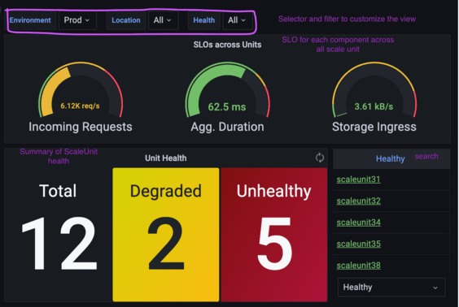
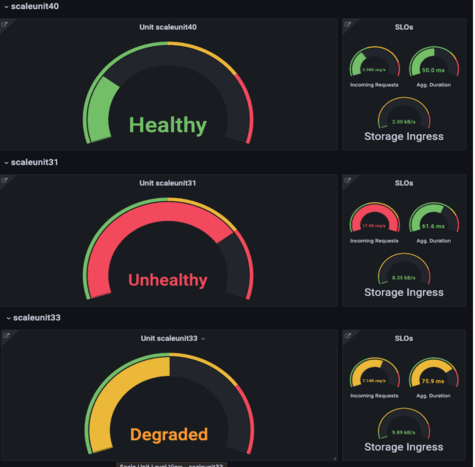
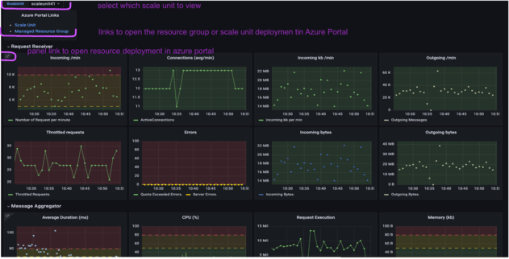
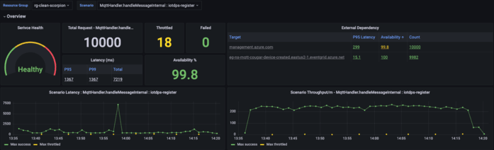
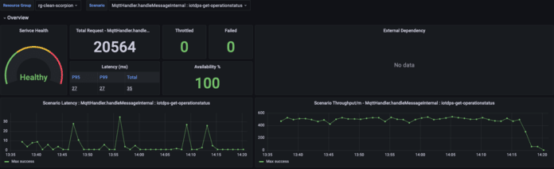

# Azure Powered Management Control Plane Starter Kit

## Problem statement

As the complexity of distributed systems continues to grow, there is an increasing need for a control plane to manage inventory, capacity, monitoring, and incident mitigation. While this need was originally identified in horizontally scaled stamped applications, clients have come to realize the benefits of a control plane and are now looking to incorporate it into their software development.

Implementing a control plane is a challenging task that often introduces significant overhead due to its complexity, including security access requirements, policy enforcement, GUI, CLI, and other aspects. Additionally, introducing a control plane usually means introducing a new set of tools that users must learn to use. Due to technology choices, increased adoption of open-source tools, and the need for multi-tenant and multi-platform support, clients often have to implement a one-off solution to address the gap from the ground up. Over the past few years, more than 50% of observed ISE control plane centric engagements were withdrawn. Some were because Microsoft considered them infeasible, while others were because the client lacked the capacity for execution.

## Solution - Azure powered Control Plane

Building a control plane can be done in many ways using a variety of services and tools. The approach taken depends on the customer's requirements, topology, and preferences. The starter kit proposes a potential solution that utilizes Azure Managed Application for security, policy enforcement, inventory control, and capacity management. All components deployed within the managed application export metrics to a log analytics workspace. Dashboards are set up in Azure Managed Grafana, which queries Azure Resource Graph for resource deployment details and uses SLO-based health modeling to create a top-level view of system health on a single pane of glass, with the ability to drill down to individual components. Azure Monitor alerts or Azure Managed Grafana alerts can be configured to trigger alerts and incident mitigation.

The goal of the control plane is to establish a system that efficiently allocates resources, responds quickly to incidents, and self-heals to ensure high availability.

### Azure Managed Applications

[Azure Managed Applications](https://learn.microsoft.com/en-us/azure/azure-resource-manager/managed-applications/overview) was created to enable service providers to offer cloud solutions that are easy for consumers to deploy and operate. It's similar to a solution template in the Marketplace where infrastructure, applications and services are packaged and deployed as one solution. We use this packaged template to help manage the deployment and scaling needs of enterprise systems that require high scalability and high reliability.

Tapping on to what Azure has to offer solves security access, policy enforcement, resource provision inventory control and gives the user the familiar choice of Azure Portal for control plane UI experience. Azure Cli is also available for task automation. [Custom actions](https://github.com/jjbfour/azure-quickstart-templates/tree/master/101-custom-rp-with-function) can be set up to manage component life cycle.

Azure Managed Application definition can be set up either on Azure Marketplace or service catalog. For control plane purposes, we'd set up the managed application definition in service catalog. Once a managed application is registered, we can deploy it either through Azure Portal UI that can be customized or through scripts. The deployed application will have two resource groups - an Application Resource Group that contains only the application resource. This is where you can customize the Azure Portal GUI and handle life cycle management of the application.  A Managed Resource Group where the provisioned resources resides. This separation of resource groups allows better RBAC control while giving the users a familiar toolset to work with.

While managed application has full fledged support for resource deployment using ARM template, the starter kit implemented a solution where it allows bash scripts and Terraform, or any client preferred IaC scripts for resource deployment. This enables easy transition for many clients because they don't have to rewrite their deployment scripts with ARM template and can use what they have for deployment. It would allow quick transition. Theoretically, it would also enable multi platform deployment. Terraform is Terraform. If you set up the right scripts and have the right access rights, you can deploy anywhere. Whether it's desirable is questionable. It's certainly doable.

### Azure Resource Graph

[Azure Resource Graph](https://learn.microsoft.com/en-us/azure/governance/resource-graph/overview) powers Azure portal's search bar. It's designed to query resources with complex filtering, grouping, and sorting by resource properties, explore resources iteratively based on governance requirements and assess the impact of applying policies in a vast cloud environment.

Azure resource graph provides resource inventory control - we know exactly what's provisioned and deployed at any given point of time. There is no need for user defined inventory persistence and will always give the correct system set up.

Setting up managed application allows easy grouping of enterprise application deployments. Most enterprise systems consist of multiple subsystems, that serve distinct function and coexist. The grouping and query ability makes it easy to implement a top level dashboard that monitors system health.

### SLO based measuring and monitoring

Health Modeling contextualizes metrics for components and services to give a conclusion on system health rather than presenting individual service indicators. SLO based health modeling uses SLO as the basis and thresholds for calculating system health. This approach uses a top-down, aggregate and then bubble up approach.

We first look at the system as a whole and determine SLO based on user expectation. Then, we break down the system and identify dependency and correlation between components and determine SLO for individual component based on load testing and overall SLO requirements. Once we have the thresholds, we can calculate component level health and aggregate to get system health.

This gives great clarity to the correlation between components once correctly set up. It will identify the trouble spot easily and can serve as a real time feedback for system configuration and resource provision guidance. For example, Azure gives resource scaling limits on individual services. However, it doesn't give guidance on resource allocation. As a matter of fact, it's hard to give guidance because it's almost always case by case situation. When it comes to complex, multi-component systems, you monitor resources getting close to their scaling limits, identify the effect on upstream and downstream services and use that knowledge to make resource allocation adjustment decisions. Do you want to scale out or scale up? How to make efficient use of resources?

We use [Azure Managed Grafana](https://learn.microsoft.com/en-us/azure/managed-grafana/overview) to [create dashboards](./azureManagedGrafana.md) using [KQL queries](https://learn.microsoft.com/en-us/azure/data-explorer/kusto/query). These queries utilize Azure Resource Graph and Azure Monitor data sources exported to a Log Analytics workspace. Since both Log Analytics workspace and Azure Resource Graph support multiple tenants and subscriptions, this approach enables a top-level dashboard view on a single pane of glass for simplicity and directness. For more information, please refer [here](./azureManagedGrafana.md).

The Starter Kit uses [Azure Monitor Alerts](https://learn.microsoft.com/en-us/azure/azure-monitor/alerts/alerts-overview) for the notifications. This approach gives many action options for automated incident mitigation.

## [ Starter Kit Repo](https://github.com/juliays/ControlPLaneStarterKit) 

The goal of the Control Plane Starter Kit is to help customers and Dev teams accelerate their implementation of a control plane project by providing a starting point. The starter kit includes a control plane implementation for a simple proof of concept (POC) scale unit. It provides sample IaC for resource provisioning and managed application deployment, automation scripts in bash, and monitoring dashboard templates, along with KQL query examples that demonstrate how to use these services for control plane implementation.

The Starter Kit also provides detailed guidance on the health modeling process, dashboard design, and setting up services to export metrics to a Log Analytics workspace. Moreover, it offers step-by-step instructions on how to leverage Azure Managed Grafana to access Azure Monitor data source and resource graph, thereby [dynamically generating the dashboards](./azureManagedGrafana.md). The kit also includes examples showcasing the use of Open Telemetry SDK to [add custom instrumentation](https://github.com/juliays/ControlPLaneStarterKit/blob/main/monitoring/scenario-based/README.md)and [templates for scenario-based dashboards](https://github.com/juliays/ControlPLaneStarterKit/tree/main/monitoring/scenario-based).

### Description of repo structure

The starter kit contains the following assets

- [docs](https://github.com/juliays/ControlPLaneStarterKit/tree/main/docs)
  - azurePoweredControlPlaneDesign.md that explains the thinking behind the solution
  - [azureManagedGrafana.md](./azureManagedGrafana.md) that explains how to implement the dashboard using Azure Monitor data source and Azure Resource Graph
- [managed-app-deployment-scripts](https://github.com/juliays/ControlPLaneStarterKit/tree/main/managed-app-deployment-scripts)
  - scripts to create managed application definition in service catalog. [Azure Documentation](https://learn.microsoft.com/en-us/azure/azure-resource-manager/managed-applications/publish-service-catalog-app?tabs=azure-powershell)
  - scripts to deploy scale unit once managed application definition is created
- [managed-app-operation-scripts](https://github.com/juliays/ControlPLaneStarterKit/tree/main/managed-app-operation-scripts)
  - scripts to implement custom actions (Work in Process)
- [monitoring](https://github.com/juliays/ControlPLaneStarterKit/tree/main/monitoring)
  - top level and scale unit level dashboard template json
  - scenario based dashboard template json
  - explanation of incorporating Open Telemetry custom telemetry
  - scripts to illustrate monitoring automation
- [pipeline](https://github.com/juliays/ControlPLaneStarterKit/tree/main/pipelines)
  - azure pipeline files to create the control plane resource group
- [sample](https://github.com/juliays/ControlPLaneStarterKit/tree/main/sample)
  - java console application that generates random traffic to Event Hub
  - Azure function app zip used in POC scale unit.
- [terraform-control-plane](https://github.com/juliays/ControlPLaneStarterKit/tree/main/terraform-control-plane)
  - terraform code used by pipeline or standalone to create the control plane resource group
- [terraform-managed-application](https://github.com/juliays/ControlPLaneStarterKit/tree/main/terraform-managed-application)
  - terraform scripts to provision the scale unit and set up diagnostic settings to export metrics to log analytics workspace

### Scale unit design

As illustrated, the POC scale unit is set up with three components:

- Event Hub that takes input request
- Azure function that gets triggered when Event Hub receives input request
- Storage account that Azure function writes output to

There is also a java console application that simulates devices sending random traffic to event hub.

There will be multiple scale unit deployed. These scale units can be deployed in different regions. The java console app can send requests to all event hubs once the correct connection string for each event hub is set up. There is a createConfigJson.sh script in monitoring/scripts folder that can be executed to create the required config.json for the java console app. You will need to log in with the right service principal for the script to run properly.

## Related Priority Scenarios

The control plane starter kit was created specifically for horizontally scaled stamped architecture. This architecture is used in many mission critical services and systems with stringent SLAs. While a single stamp may endure longer down time, uncorrelated multiple stamps can share load and fail over for each other and greatly reduce the down time. However, this high availability nature makes system faults hard to detect. WHen it becomes noticeable, it's often too late.The control plane provides clarity. The dashboard will identify scale units degraded or unhealthy and trigger alerts when it first happens. The real time feedback allows efficient resource allocation and gives guidance on system design and implementation decisions besides enabling alerts and mitigation. All will help make the system more robust.

Dashboard screen shot. Please review [this link](./azureManagedGrafana.md)to find details on dashboard design and system health calculation explanations as well as KQL examples.

 

Scenario based dashboards -

 

## Resources

- [Azure Managed Applications](https://learn.microsoft.com/en-us/azure/azure-resource-manager/managed-applications/overview)
- [Azure Managed Grafana](https://learn.microsoft.com/en-us/azure/managed-grafana/overview)
- [Azure Resource Graph](https://learn.microsoft.com/en-us/azure/governance/resource-graph/overview)
- [KQL](https://learn.microsoft.com/en-us/azure/data-explorer/kusto/query/)
- [Azure Monitor Alerts](https://learn.microsoft.com/en-us/azure/azure-monitor/alerts/alerts-overview)
- [Open Telemetry](https://opentelemetry.io/docs/what-is-opentelemetry/)
- [Application Insights](https://learn.microsoft.com/en-us/azure/azure-monitor/app/app-insights-overview?tabs=java)
- [Deployment Stamp Architecture](https://learn.microsoft.com/en-us/azure/architecture/patterns/deployment-stamp)

__NOTES:__ If you have additional question or would like to learn more about the process, please contact [Yang Song](mailto:songy@microsoft.com)
