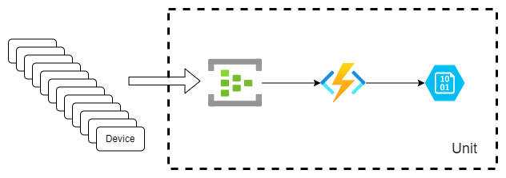

# Managed Scale Unit

## Managed Scale Unit Description

This Managed Application represents our example scale unit. The scale unit looks like the below:

||
|:--:|
|**Figure 1** - *Scale Unit Definition*|

When creating the managed application, the user is presented with this dialog in the portal:

||
|:--:|
|**Figure 2** - *Managed Application Portal Creation*|

Field explanations are as follows:

|Parameter|Description|
|---------|-----------|
|**Region**|Region you would like to create the scale unit definition in. _Please Note:_ this is not where your scale unit runs|
|**Scale Unit Name**|The name of your scale unit|
|**Function Zip Package URL**|The URL to where the function Zip file is located. This is used in the scale unit function|
|**Log Analytics Workspace ID**|Log analytics workspace id. This is the resource identifier|
|**Terraform Deployment Zip URL**|The URL to where the zipped Terraform files are located|
|**Terraform Folder**|Since the Terraform folder is zipped, the script changes directory into the Terraform directory (as is TF best practices). This folder is where to change directory from there. More in the notes below|
|**Storage Account Name**|What storage account name in this subscription to store the TFSTATE file|
|**Application Name**|The application name to create for this managed application. Usually the same name as Scale Unit Name|
|**Application Resources Resource Group Name**|The name of the managed resource group. _Please Note:_ this __IS__ where your scale unit runs|

__NOTES:__ 
1. Terraform Deployment Zip URL must be accessible in your subscription via anonymous blob container access
2. Function Zip Package URL must be accessible in your subscription via anonymous blob container access
3. You need to create a user managed identity "deployment_controller" that's part of the ControlPlanePOC resource group and assign it Monitoring Contributor and Log Analytics Contributor rights. 
4. "Appliance Resource Provider" Identity need to have "assign" access to the deployment_controller. 